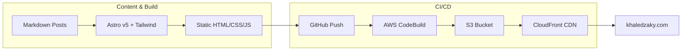
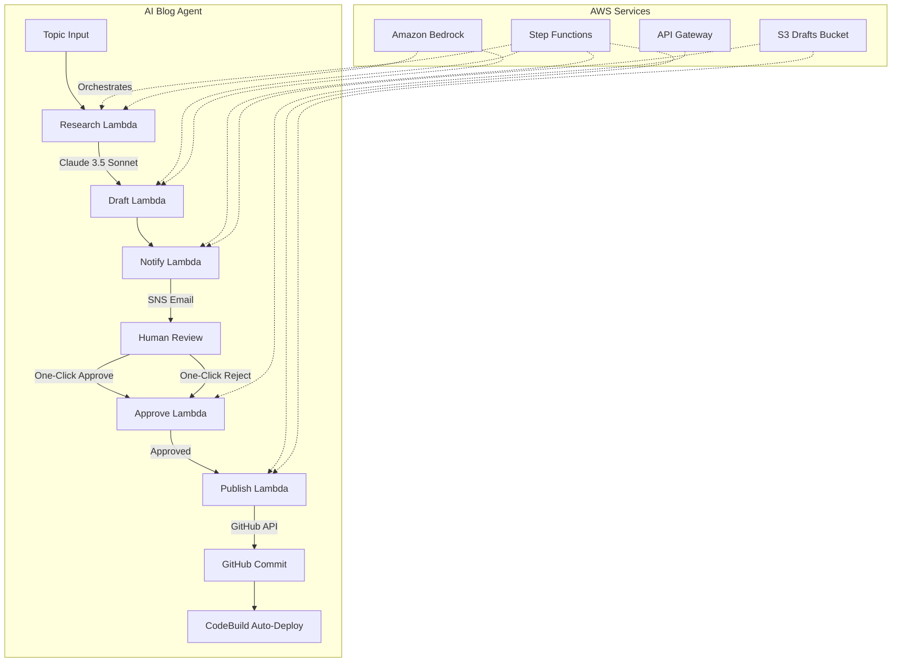
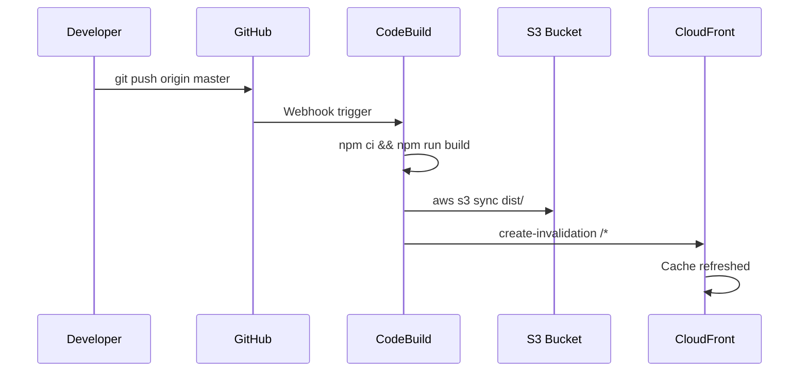
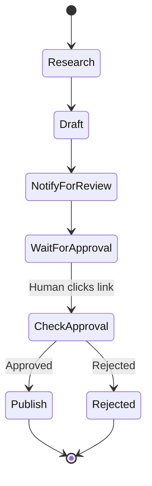

# khaledzaky.com

[]()
[](https://opensource.org/licenses/MIT)

My personal website and blog — [khaledzaky.com](https://khaledzaky.com)

Built with [Astro](https://astro.build) and [Tailwind CSS](https://tailwindcss.com), deployed on AWS, with an AI-powered blog agent that researches, drafts, and publishes posts with human-in-the-loop approval.

---

## Architecture Overview





## Tech Stack

| Layer | Technology |
|-------|-----------|
| **Framework** | Astro v5 with Tailwind CSS v3 + `@tailwindcss/typography` |
| **Content** | Markdown with Astro content collections |
| **Build** | AWS CodeBuild (Node.js 20) |
| **Hosting** | Amazon S3 + CloudFront |
| **TLS** | AWS Certificate Manager |
| **AI Model** | Claude 3.5 Sonnet v2 via Amazon Bedrock |
| **Orchestration** | AWS Step Functions |
| **Approval** | API Gateway HTTP API + Lambda |
| **Notifications** | Amazon SNS (email) |
| **Secrets** | AWS SSM Parameter Store (SecureString) |
| **Source Control** | GitHub (master branch, webhook-triggered deploys) |

## Project Structure

```
khaledzaky.com/
├── src/
│   ├── components/       # Astro components (Header, Footer, SectionCard)
│   ├── content/blog/     # Markdown blog posts (content collection)
│   ├── layouts/          # BaseLayout, BlogPost layout
│   └── pages/            # index, about, work, blog routes
├── public/               # Static assets (images, favicon)
├── agent/                # AI blog agent (Lambda functions + IaC)
│   ├── research/         # Topic research via Bedrock
│   ├── draft/            # Blog post drafting via Bedrock
│   ├── notify/           # SNS email with one-click approve/reject
│   ├── approve/          # API Gateway handler for approval callbacks
│   ├── publish/          # Commits approved posts to GitHub
│   ├── template.yaml     # CloudFormation (SAM) template
│   └── deploy.sh         # One-command deployment script
├── buildspec.yml         # AWS CodeBuild build specification
├── astro.config.mjs      # Astro configuration
├── tailwind.config.cjs   # Tailwind configuration
└── package.json
```

## Running Locally

```bash
# Clone the repo
git clone https://github.com/kzaky/khaledzaky.com.git
cd khaledzaky.com

# Install dependencies
npm install

# Start dev server
npm run dev
# → http://localhost:4321

# Build for production
npm run build
# → outputs to dist/
```

## Deployment

Deployment is fully automated. Pushing to `master` triggers AWS CodeBuild, which:

1. Installs dependencies (`npm ci`)
2. Builds the site (`npm run build`)
3. Syncs `dist/` to the S3 bucket
4. Invalidates the CloudFront cache



## AI Blog Agent

The blog agent is a serverless pipeline that researches topics, drafts blog posts using Claude, and publishes them with human approval.

### How It Works

1. **Trigger** — Start an execution with a topic and categories
2. **Research** — Claude researches the topic and produces structured notes
3. **Draft** — Claude writes a complete Markdown blog post with Astro frontmatter
4. **Notify** — Draft is saved to S3 and an email is sent with a preview and one-click approve/reject links
5. **Review** — The pipeline pauses and waits for human approval (up to 7 days)
6. **Publish** — On approval, the post is committed to GitHub via API, triggering auto-deploy

### Deploying the Agent

Prerequisites:
- AWS CLI configured with appropriate credentials
- GitHub Personal Access Token stored in SSM:
  ```bash
  aws ssm put-parameter --name "/blog-agent/github-token" \
    --type SecureString --value "ghp_YOUR_TOKEN"
  ```
- Amazon Bedrock model access enabled for Anthropic Claude

Deploy:
```bash
cd agent
./deploy.sh your-email@example.com
```

Confirm the SNS email subscription when you receive it.

### Triggering a New Post

```bash
aws stepfunctions start-execution \
  --state-machine-arn $(aws cloudformation describe-stacks \
    --stack-name blog-agent \
    --query 'Stacks[0].Outputs[?OutputKey==`StateMachineArn`].OutputValue' \
    --output text) \
  --input '{"topic": "Your topic here", "categories": ["tech", "cloud"]}'
```

### Agent Architecture



### Security

- **Secrets** — GitHub token stored in SSM Parameter Store as SecureString, never in code
- **IAM** — Lambda role follows least-privilege with scoped policies per service
- **API Gateway** — Approval endpoint is public but uses one-time Step Functions task tokens that expire
- **Encryption** — S3 bucket uses default encryption; SSM parameters use AWS-managed KMS
- **No hardcoded credentials** — All sensitive values are injected via environment variables or SSM at runtime

### Cost Estimate

The agent is designed to be extremely cheap to run:

| Resource | Cost |
|----------|------|
| Lambda (5 functions, ~30s/invocation) | ~$0.00 per post |
| Step Functions (1 execution) | ~$0.00 per post |
| Bedrock Claude 3.5 Sonnet (~2K tokens in, ~4K out) | ~$0.03 per post |
| S3 (draft storage) | ~$0.00 |
| SNS (1 email) | ~$0.00 |
| API Gateway (1 request) | ~$0.00 |
| **Total per post** | **~$0.03** |

At 10 posts/month, the agent costs roughly **$0.30/month**. The S3 hosting and CloudFront for the website itself is the primary cost (~$1-2/month).

## License & Copyright

Copyright Khaled Zaky. You may not reuse the following without written permission:
- `src/content/blog/` (blog post content)
- `public/img/` (personal images)

The code and styles are licensed under the [MIT License](LICENSE).
