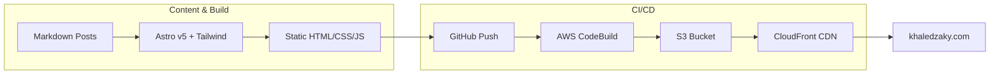
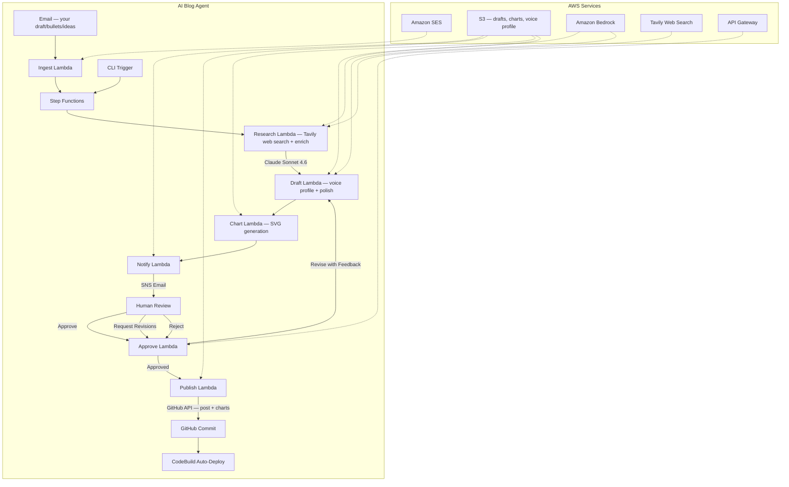
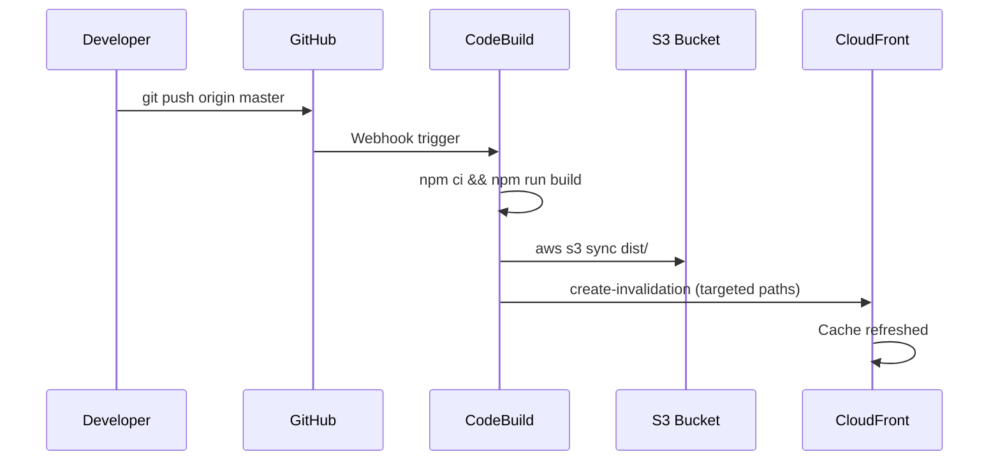
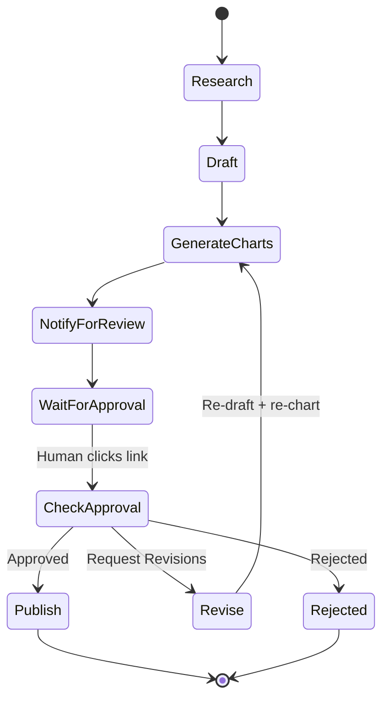

# khaledzaky.com

[](https://github.com/kzaky/khaledzaky.com/actions/workflows/ci.yml)
[]()
[](https://opensource.org/licenses/MIT)
[](https://astro.build)
[](https://tailwindcss.com)
[](https://aws.amazon.com/lambda/)
[](https://aws.amazon.com/bedrock/)
[](https://python.org)
[](https://aws.amazon.com/cloudformation/)

My personal website and blog — [khaledzaky.com](https://khaledzaky.com)

Built with [Astro](https://astro.build) and [Tailwind CSS](https://tailwindcss.com), deployed on AWS, with an AI-powered blog agent that researches, drafts, and publishes posts with human-in-the-loop approval.

---

## Architecture Overview





## Tech Stack

| Layer | Technology |
|-------|-----------|
| **Framework** | Astro v5 with Tailwind CSS v4 (`@tailwindcss/vite` + `@tailwindcss/typography`) |
| **Content** | Markdown with Astro content collections |
| **Build** | AWS CodeBuild (Node.js 20) |
| **Hosting** | Amazon S3 (OAC-locked) + CloudFront (HTTPS-only, compressed, security headers) |
| **TLS** | AWS Certificate Manager |
| **AI Model** | Claude Sonnet 4.6 via Amazon Bedrock (with voice profile) |
| **Web Search** | Tavily API (real-time web sources for citations) |
| **Charts & Diagrams** | SVG bar/donut charts (from numeric data) + conceptual diagrams: comparison, progression, stack, convergence, venn (LLM-detected, code-rendered). All support light/dark mode via CSS custom properties. SVGs are inlined at build time via rehype plugin |
| **Orchestration** | AWS Step Functions |
| **Approval** | API Gateway HTTP API + Lambda |
| **Notifications** | Amazon SNS (email) |
| **Email Ingest** | Amazon SES (inbound) + Route 53 MX |
| **DNS** | Amazon Route 53 |
| **Secrets** | AWS SSM Parameter Store (SecureString) — GitHub token + Tavily API key |
| **Source Control** | GitHub (master branch, webhook-triggered deploys) |

## Project Structure

```
khaledzaky.com/
├── src/
│   ├── components/       # Astro components (Header, Footer, SectionCard, CredibilityRow)
│   ├── content/blog/     # Markdown blog posts (content collection)
│   ├── layouts/          # BaseLayout, BlogPost layout
│   ├── pages/            # index, about, work, blog routes (includes rss.xml.js)
│   ├── plugins/          # Rehype plugins (lazy images, inline SVGs)
│   └── styles/           # Global CSS (Tailwind v4 @theme + design tokens)
├── public/               # Static assets (images, favicon)
├── agent/                # AI blog agent (Lambda functions + IaC)
│   ├── research/         # Enriches author's points with data & citations
│   ├── draft/            # Polishes author content using voice profile
│   ├── chart/            # Renders SVG charts + conceptual diagrams (5 types)
│   ├── notify/           # SNS email with one-click approve/revise/reject
│   ├── approve/          # API Gateway handler for approval + revision feedback
│   ├── publish/          # Commits posts + chart images to GitHub
│   ├── ingest/           # SES email trigger — parses author content & directives
│   ├── voice-profile.md  # Author voice & style guide (injected into prompts)
│   ├── template.yaml     # CloudFormation (SAM) template
│   └── deploy.sh         # One-command deployment script
├── infra/                # Site infrastructure IaC
│   ├── template.yaml     # CloudFormation — CloudFront, IAM, monitoring, CloudTrail
│   ├── storage.yaml      # CloudFormation — S3 bucket (us-east-2)
│   └── deploy.sh         # Deployment script (requires email, cert ARN, zone ID)
├── buildspec.yml         # AWS CodeBuild build specification
├── astro.config.mjs      # Astro configuration
└── package.json
```

## Running Locally

```bash
# Clone the repo
git clone https://github.com/kzaky/khaledzaky.com.git
cd khaledzaky.com

# Install dependencies
npm install

# Start dev server
npm run dev
# → http://localhost:4321

# Build for production
npm run build
# → outputs to dist/
```

## Deployment

Deployment is fully automated. Pushing to `master` triggers AWS CodeBuild, which:

1. Installs dependencies (`npm ci`)
2. Builds the site (`npm run build`)
3. Syncs `dist/` to the S3 bucket (`--delete` to remove stale files)
4. Invalidates the CloudFront cache



## AI Blog Agent

The blog agent is your **editor, not your ghostwriter**. You provide your draft, bullets, or ideas — the agent enriches them with research and data, polishes the prose in your voice, generates data-driven charts and conceptual diagrams, and publishes with your approval.

### How It Works

1. **Trigger** — Send an email to `blog@khaledzaky.com` with your draft/bullets in the body, or run the CLI
2. **Ingest** (email only) — SES receives the email; Ingest Lambda parses author content and optional directives (Categories, Tone, Hero)
3. **Research** — Tavily web search finds real sources, then Claude Sonnet 4.6 enriches the author's points with supporting data, statistics, and verified citations. A second focused LLM pass extracts structured data points for chart generation
4. **Draft** — Claude Sonnet 4.6 polishes and structures the author's content using an injected voice profile, weaving in research data. A second pass identifies quantitative claims and inserts chart placeholders. A third pass detects conceptual ideas (comparisons, progressions, layered stacks, convergence patterns) and inserts structured diagram placeholders
5. **Chart & Diagram** — Handles two types of visuals: (1) matches structured data points to `<!-- CHART: -->` placeholders and renders SVG bar/donut charts, (2) parses `<!-- DIAGRAM: -->` placeholders and renders conceptual SVG diagrams (comparison, progression, stack, convergence, venn). All visuals use the site's color palette with light/dark mode support (CSS custom properties + `.dark` class)
6. **Notify** — Draft (with charts and diagrams) is saved to S3 and a full-text email is sent with a presigned download link and three one-click actions
7. **Review** — The pipeline pauses and waits for human action (up to 7 days):
   - **Approve** — publishes the post and charts immediately
   - **Request Revisions** — opens a feedback form; the agent revises and re-sends
   - **Reject** — discards the draft
8. **Publish** — On approval, the post, chart images, and diagram SVGs are committed to GitHub via API, triggering auto-deploy

### Deploying the Agent

Prerequisites:
- AWS CLI configured with appropriate credentials
- GitHub Personal Access Token stored in SSM:
  ```bash
  aws ssm put-parameter --name "/blog-agent/github-token" \
    --type SecureString --value "ghp_YOUR_TOKEN"
  ```
- Amazon Bedrock model access enabled for Anthropic Claude

Deploy:
```bash
cd agent
./deploy.sh your-email@example.com
```

Confirm the SNS email subscription when you receive it.

### Triggering a New Post

**Option 1: Email** (preferred)

Send an email from your authorized address to `blog@khaledzaky.com`:
- **Subject** = your blog topic or title idea
- **Body** = your draft, bullets, ideas, or stream of consciousness
- Optional directives: `Categories: tech, cloud`, `Tone: more technical`, `Hero: yes`

The agent uses your content as the skeleton and polishes it in your voice.

**Option 2: CLI**

```bash
aws stepfunctions start-execution \
  --state-machine-arn $(aws cloudformation describe-stacks \
    --stack-name blog-agent \
    --query 'Stacks[0].Outputs[?OutputKey==`StateMachineArn`].OutputValue' \
    --output text) \
  --input '{"topic": "Your topic here", "categories": ["tech", "cloud"], "author_content": "Your bullets and ideas..."}'
```

### Agent Architecture



### Security

- **Secrets** — GitHub token and Tavily API key stored in SSM Parameter Store as SecureString, never in code or environment variables
- **IAM** — Each Lambda function has its own IAM role scoped to only the permissions it needs (e.g., Approve can only send task tokens, Ingest can only read inbound email and start executions, Publish can only read drafts and access the GitHub token)
- **API Gateway** — Approval endpoint is public but uses one-time Step Functions task tokens that expire after 7 days
- **S3** — AES-256 server-side encryption enabled; all public access blocked (4/4 settings); Origin Access Control (OAC) restricts reads to CloudFront only; S3 website hosting disabled
- **SES** — TLS required on inbound email; spam and virus scanning enabled; only authorized sender processed
- **Encryption** — SSM parameters use AWS-managed KMS
- **No hardcoded credentials** — All sensitive values injected via environment variables or SSM at runtime
- **Lifecycle** — Draft objects auto-expire after 90 days

### Cost Estimate

The agent is designed to be extremely cheap to run:

| Resource | Cost |
|----------|------|
| Lambda (7 functions, ~30s/invocation) | ~$0.00 per post |
| Step Functions (1 execution) | ~$0.00 per post |
| Bedrock Claude Sonnet 4.6 (~5 calls/post: research, data extraction, draft, chart placement, diagram detection) | ~$0.08 per post |
| Tavily web search (2 queries/post, free tier: 1,000/month) | ~$0.00 |
| S3 (draft storage) | ~$0.00 |
| SNS (1 email) | ~$0.00 |
| API Gateway (1-3 requests) | ~$0.00 |
| SES (1 inbound email) | ~$0.00 |
| **Total per post** | **~$0.08** |

At 10 posts/month, the agent costs roughly **$0.80/month**. The website infrastructure itself costs ~$3.50/month (primarily Route 53 hosted zone fees).

## Infrastructure Hardening

The hosting infrastructure has been hardened across security, performance, and cost:

| Area | Detail |
|------|--------|
| **S3 Access** | Public access fully blocked; Origin Access Control (OAC) restricts reads to CloudFront distribution ARN only |
| **HTTPS** | HTTP requests 301-redirect to HTTPS; TLS 1.2 minimum enforced |
| **Security Headers** | CSP, HSTS (preload), X-Frame-Options, X-Content-Type-Options, Referrer-Policy, X-XSS-Protection, Permissions-Policy, X-Robots-Tag via CloudFront response headers policy |
| **Compression** | Gzip + Brotli enabled on CloudFront |
| **URL Rewriting** | CloudFront Function handles `index.html` resolution (replaces S3 website hosting) |
| **Custom Errors** | 403 and 404 mapped to `/404.html` |
| **TLS Certificate** | Wildcard ACM cert (`*.khaledzaky.com` + apex), auto-renewing |
| **Price Class** | PriceClass_100 (NA + EU edge locations) |
| **HTTP/2 + HTTP/3** | Both enabled on CloudFront |

## Infrastructure as Code

All infrastructure is managed via CloudFormation across three stacks:

| Stack | Region | Resources |
|-------|--------|-----------|
| **`khaledzaky-infra`** | us-east-1 | CloudFront distribution, OAC, security headers policy, index rewrite function, IAM role, Route 53 health check, CloudWatch alarm + dashboard, CloudTrail |
| **`khaledzaky-storage`** | us-east-2 | S3 site bucket (versioning, AES-256 + BucketKey, 90-day lifecycle) |
| **`blog-agent`** | us-east-1 | 7 Lambda functions, Step Functions, SNS, S3 drafts bucket, API Gateway (throttled: 5 req/s, burst 10) |

Resources not in CFN (import not supported): CodeBuild project, AWS Budget, S3 bucket policy.

## Monitoring & Observability

| Area | Detail |
|------|--------|
| **Uptime** | Route 53 HTTPS health check (30s interval) → CloudWatch alarm → SNS email if site goes down |
| **Dashboard** | CloudWatch dashboard: CloudFront requests/errors/cache hit rate, billing, S3 size |
| **Audit** | CloudTrail multi-region trail → S3 (management events) |
| **Tracing** | X-Ray active on all 7 Lambda functions + Step Functions |
| **Budget** | $25/month with 80% and 100% email alerts |
| **SEO** | Google Search Console verified, sitemap + RSS autodiscovery, JSON-LD schema |

## License & Copyright

Copyright Khaled Zaky. All rights reserved for the following — you may not reuse without written permission:
- `src/content/blog/` (blog post content)
- `public/img/` (personal images)

The code and styles are licensed under the [MIT License](LICENSE).
