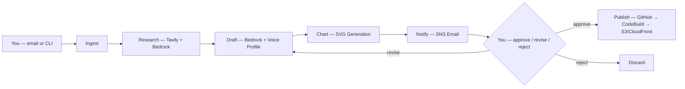

# Blog Agent — AI-Assisted Blog Writing Pipeline

An AWS-native blog writing agent that takes your draft, bullets, or ideas — enriches them with research and data — and produces a polished blog post in your voice. Human-in-the-loop (HITL) approval at every step.

## Philosophy

The agent is your **editor, not your ghostwriter**. You provide the ideas, opinions, and framing. The agent:
1. Enriches your points with supporting data, statistics, and citations
2. Polishes prose and structures the post using your voice profile
3. Generates data-driven SVG charts (Galloway-style) from research data
4. Publishes to your site after your explicit approval

## Architecture



### Components (7 Lambda functions)
- **Ingest Lambda** — Receives inbound email via SES, parses author content and directives (Categories, Tone, Hero), starts the pipeline
- **Research Lambda** — Searches Tavily for real web sources, then uses Bedrock Claude Sonnet 4.6 to enrich the author's points with supporting evidence, data, and verified citations. A second focused LLM pass extracts structured data points for chart generation. Graceful fallback if Tavily is unavailable. Two modes: author-content enrichment (primary) and open research (fallback)
- **Draft Lambda** — Uses Bedrock Claude Sonnet 4.6 with an injected voice profile to polish and structure the author's content. A second LLM pass scans the draft for quantitative claims and inserts chart placeholders where research data supports a visual. Three modes: author-content polishing, revision from feedback, and topic-only fallback
- **Chart Lambda** — Matches structured data points from research to `<!-- CHART: -->` placeholders in the draft, renders Galloway-style SVG bar and donut charts, saves to S3
- **Notify Lambda** — Stores draft in S3, sends full-text SNS email with presigned S3 download link (7-day expiry) and one-click approve/revise/reject links
- **Approve Lambda** — API Gateway handler that processes approval, revision feedback, or rejection
- **Publish Lambda** — On approval, commits the post and any chart images to GitHub (triggers CodeBuild deploy)

### Supporting Services
- **Step Functions** — Orchestrates the pipeline: Research → Draft → Chart → HITL Review → Publish (with revision loop)
- **API Gateway** — HTTP API for one-click approval actions from email
- **SNS** — Email notifications for draft review
- **SES** — Inbound email processing (receives emails to `blog@khaledzaky.com`)
- **S3** — Draft and chart storage, voice profile config (auto-expires drafts after 90 days)
- **SSM Parameter Store** — Secure storage for GitHub token and Tavily API key
- **Tavily** — Web search API for real-time source discovery and citation verification (free tier: 1,000 searches/month)

### Voice Profile
The agent loads `voice-profile.md` from S3 at runtime and injects it into every Draft prompt. The profile was extracted from analysis of 20+ existing blog posts and captures:
- Tone, sentence structure, opening/closing patterns
- Vocabulary preferences and anti-patterns
- Technical depth expectations
- What Khaled always/never does in writing

See [`voice-profile.md`](voice-profile.md) for the full profile.

## Cost Estimate (~4 posts/month)
- **Bedrock (Claude Sonnet 4.6):** ~$0.24/month (~4 LLM calls/post: research, data extraction, draft, chart placement)
- **Tavily web search:** ~$0.00/month (free tier: 1,000 searches/month, ~2 per post)
- **Lambda (7 functions):** ~$0.00 (free tier)
- **Step Functions:** ~$0.00 (free tier)
- **SNS:** ~$0.00 (free tier, email)
- **API Gateway:** ~$0.00
- **SES (inbound):** ~$0.00
- **S3:** ~$0.01/month
- **Total: ~$0.25/month**

## Prerequisites

1. **AWS CLI** configured with credentials
2. **Amazon Bedrock** model access enabled for Claude in your region (us-east-1)
3. **GitHub Personal Access Token** with `repo` scope

## Setup

### 1. Store GitHub token in SSM
```bash
aws ssm put-parameter \
  --name "/blog-agent/github-token" \
  --type SecureString \
  --value "ghp_YOUR_TOKEN_HERE" \
  --region us-east-1
```

### 2. Store Tavily API key in SSM
```bash
aws ssm put-parameter \
  --name "/blog-agent/tavily-api-key" \
  --type SecureString \
  --value "tvly-YOUR_KEY_HERE" \
  --region us-east-1
```
Sign up at [app.tavily.com](https://app.tavily.com) for a free API key (1,000 searches/month).

### 3. Enable Bedrock model access
- Go to AWS Console → Amazon Bedrock → Model access
- Request access to `Anthropic Claude Sonnet 4.6`

### 4. Deploy the stack
```bash
cd agent
chmod +x deploy.sh
./deploy.sh your-email@example.com
```

This will:
- Deploy the CloudFormation stack (7 Lambdas, Step Functions, S3, SNS, API Gateway)
- Upload Lambda code from each function directory
- Upload the voice profile to S3 (`config/voice-profile.md`)

### 5. Confirm SNS subscription
Check your email and click the confirmation link.

## Usage

### Trigger via email (preferred)
Send an email to `blog@khaledzaky.com`:
- **Subject** = your blog topic or title idea
- **Body** = your draft, bullets, ideas, or stream of consciousness

The agent uses your content as the skeleton and polishes it in your voice.

#### Optional directives (add anywhere in the body)
```
Categories: tech, cloud, leadership
Tone: more technical
Hero: yes
```

### Trigger via CLI
```bash
aws stepfunctions start-execution \
  --state-machine-arn <STATE_MACHINE_ARN> \
  --input '{"topic": "Zero Trust Architecture in AWS", "categories": ["cloud", "aws", "security"], "author_content": "My bullets and ideas here..."}'
```

### Review the draft
You'll receive an email with:
- A preview of the draft (with charts embedded)
- Three one-click action links:
  - **Approve** — publishes the post and charts to GitHub immediately
  - **Request Revisions** — opens a feedback form; the agent revises and re-sends
  - **Reject** — discards the draft

All actions are handled via API Gateway — no CLI needed.

## Customization

### Update the voice profile
Edit `voice-profile.md` and redeploy (or upload directly):
```bash
aws s3 cp voice-profile.md s3://blog-agent-drafts/config/voice-profile.md
```

### Schedule automatic runs
Uncomment the `ScheduledTrigger` section in `template.yaml` and set your preferred schedule and default topic.

### Edit the prompts
- **Research enrichment:** `research/index.py` — controls how the agent finds supporting evidence
- **Draft polishing:** `draft/index.py` — controls how the agent structures and polishes your content
- **Chart style:** `chart/index.py` — colors, fonts, and chart rendering

### Change the model
The agent uses Claude Sonnet 4.6 via inference profile (`us.anthropic.claude-sonnet-4-6`). To change the model, update the `BedrockModelId` parameter in `template.yaml`.
