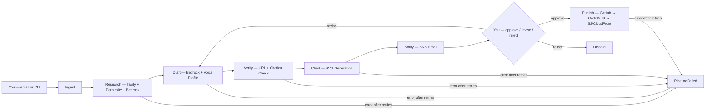

# Blog Agent — AI-Assisted Blog Writing Pipeline

An AWS-native blog writing agent that takes your draft, bullets, or ideas — enriches them with research and data — and produces a polished blog post in your voice. Human-in-the-loop (HITL) approval at every step.

## Philosophy

The agent is your **editor, not your ghostwriter**. You provide the ideas, opinions, and framing. The agent:
1. Enriches your points with supporting data, statistics, and citations
2. Polishes prose and structures the post using your voice profile
3. Generates data-driven SVG charts and conceptual diagrams (comparisons, staircase models, layered stacks, convergence patterns, Venn diagrams) from the draft content
4. Publishes to your site after your explicit approval

## Architecture


```mermaid
flowchart LR
    A[You — email or CLI] --> B[Ingest]
    B --> C[Research — Tavily + Perplexity + Bedrock]
    C --> D[Draft — Bedrock + Voice Profile]
    D --> V[Verify — URL + Citation Check]
    V --> E[Chart — SVG Generation]
    E --> F[Notify — SNS Email]
    F --> G{You — approve / revise / reject}
    G -->|approve| H[Publish — GitHub → CodeBuild → S3/CloudFront]
    G -->|revise| D
    G -->|reject| I[Discard]
    C -->|error after retries| J[PipelineFailed]
    D -->|error after retries| J
    V -->|error after retries| J
    E -->|error after retries| J
    H -->|error after retries| J
```

### Components (10 Lambda functions)
- **Ingest Lambda** — Receives inbound email via SES, parses author content and directives (Categories, Tone, Hero), starts the pipeline. SQS dead letter queue catches failed async invocations
- **Research Lambda** — Generates 5-8 targeted search queries via Claude Haiku, then runs two parallel searches simultaneously: Tavily (all queries, 8 results each — breadth) and Perplexity sonar-pro (first 2 reshaped queries — independent synthesis + citation URLs). Perplexity queries are reformulated from keyword form to natural-language questions by a Haiku pass (`build_perplexity_queries`) that overlaps with the Tavily search executor. After search results are assembled, two Haiku/Sonnet passes run in parallel: `_extract_editorial_hooks` (Haiku — surfaces contradictions, surprises, and expert tensions from Perplexity synthesis + Tavily snippets) and `_thinking_plan` (Sonnet `invoke_model+thinking` — frames research angles and post structure). Both outputs are injected into the main synthesis prompt. Research synthesis (Sonnet) produces enriched notes with verified inline citations. A cross-reference fact-check pass (Haiku) verifies key claims against sources. URL verification drops broken sources before they reach the draft. Graceful degradation if either search engine is unavailable. Cold-start smoke test validates the thinking API contract on every new container
- **Draft Lambda** — Two-pass architecture: (1) short thinking pass via `invoke_model` (Claude Sonnet 4.6 with extended thinking, `budget_tokens: 2000`) produces a drafting/revision plan, (2) full generation pass via `invoke_model` produces the complete post. Five deterministic passes follow: chart placeholder insertion (Haiku), diagram placeholder insertion (Haiku), citation audit (Sonnet 8192 tokens — rewrites full draft with any citation corrections, never truncates), voice profile compliance audit (Sonnet 8192 tokens — always rewrites with fixes, no annotation-only fallback regardless of post length), and insight audit (Sonnet 8192 tokens — flags generic paragraphs with `<!-- ⚡ INSIGHT: ... -->` annotations, runs on all posts regardless of length). Auto-generates frontmatter description if missing. Three modes: author-content polishing, revision from feedback, topic-only fallback
- **Verify Lambda** — Post-draft citation verification. Fetches every external URL in the markdown, extracts page title and content excerpt, then uses an LLM to check whether each link's surrounding claim is actually supported by the page content. Hard failures annotated as `<!-- ⚠️ CITATION FAIL: ... -->`, soft concerns as `<!-- 💡 CITATION NOTE: ... -->`. Adds verification summary (total/passed/repaired/warnings/failures/unreachable) to pipeline output
- **Chart Lambda** — Handles two types of visuals: (1) matches structured data points from research to `<!-- CHART: -->` placeholders and renders SVG bar/donut charts, (2) parses `<!-- DIAGRAM: -->` placeholders and renders conceptual SVG diagrams (comparison, progression, stack, convergence, venn). All visuals use the site's color palette with light/dark mode support (CSS custom properties + `.dark` class). Saves to S3
- **Notify Lambda** — Stores draft in S3, sends full-text SNS email with presigned S3 download link (7-day expiry), one-click approve/revise/reject links, and a citation quality summary block (links checked, passed, auto-repaired, warnings, failures, unreachable). Quality score excludes unreachable links from its denominator
- **Approve Lambda** — API Gateway handler that processes approval, revision feedback, or rejection
- **Publish Lambda** — On approval, strips all review-only annotation comments (`<!-- ⚠️ CITATION FAIL: -->`, `<!-- 💡 CITATION NOTE: -->`, `<!-- ⚡ INSIGHT: -->`; `<!-- 🎙️ VOICE: -->` retained as legacy safety-net), then commits the clean post and chart images to GitHub (triggers CodeBuild deploy). Retries GitHub API calls up to 4 times with exponential backoff (base 3s, max ~27s) on transient errors (502/503/504). Safety net: catches any unclosed leading `<!--` after frontmatter to prevent the post body being swallowed

### Supporting Services
- **Step Functions** — Orchestrates the pipeline: Research → Draft → Verify → Chart → HITL Review → Publish (with revision loop). All Task states have Retry (exponential backoff on Lambda transient errors) and Catch → PipelineFailed for unrecoverable errors
- **API Gateway** — HTTP API for one-click approval actions from email
- **SNS** — Email notifications for draft review
- **SES** — Inbound email processing (receives emails to `blog@khaledzaky.com`)
- **S3** — Draft and chart storage, voice profile config (auto-expires drafts after 90 days)
- **SSM Parameter Store** — Secure storage for GitHub token, Tavily API key, and Perplexity API key
- **Tavily** — Web search API for real-time source discovery (free tier: 1,000 searches/month; runs all 5-8 queries for breadth)
- **Perplexity** — sonar-pro API for independent synthesis and citation discovery (runs first 2 queries in parallel with Tavily; graceful degradation if key absent)

### Voice Profile
The agent loads `voice-profile.md` from S3 at runtime and injects it into every Draft prompt. The profile was extracted from analysis of 20+ existing blog posts and captures:
- Tone, sentence structure, opening/closing patterns
- Vocabulary preferences and anti-patterns
- Technical depth expectations
- What Khaled always/never does in writing

See [`voice-profile.md`](voice-profile.md) for the full profile.

## Cost Estimate (~$0.65/pipeline run)
- **Bedrock (Claude Sonnet 4.6 + Haiku):** ~$0.65/run (~14 LLM calls/run across Research + Draft: query generation, Perplexity query reshape, editorial hooks extraction, research thinking plan, research synthesis, cross-ref fact-check, chart data extraction, draft thinking plan, full draft, chart placeholder insertion, diagram placeholder insertion, citation audit (Sonnet 8192), voice audit (Sonnet 8192), insight audit (Sonnet 8192) — passes 5+6+7 all run on Sonnet at 8192-token output budget, no length limits, no skips)
- **Tavily web search:** ~$0.00/month (free tier: 1,000 searches/month; 5-8 queries/run at 8 results each)
- **Perplexity sonar-pro:** ~$0.03/month (~2 queries/run × ~5 runs = ~10 searches at $3/1,000)
- **Lambda (10 functions):** ~$0.00 (free tier)
- **Step Functions:** ~$0.00 (free tier)
- **SNS:** ~$0.00 (free tier, email)
- **API Gateway:** ~$0.00
- **SES (inbound):** ~$0.00
- **S3:** ~$0.01/month
- **Total at ~15 runs/month (4–6 posts + revisions/retries): ~$10–12/month Bedrock**

## Prerequisites

1. **AWS CLI** configured with credentials
2. **Amazon Bedrock** model access enabled for Claude in your region (us-east-1)
3. **GitHub Personal Access Token** with `repo` scope

## Setup

### 1. Store GitHub token in SSM
```bash
aws ssm put-parameter \
  --name "/blog-agent/github-token" \
  --type SecureString \
  --value "ghp_YOUR_TOKEN_HERE" \
  --region us-east-1
```

### 2. Store Tavily API key in SSM
```bash
aws ssm put-parameter \
  --name "/blog-agent/tavily-api-key" \
  --type SecureString \
  --value "tvly-YOUR_KEY_HERE" \
  --region us-east-1
```
Sign up at [app.tavily.com](https://app.tavily.com) for a free API key (1,000 searches/month).

### 3. Store Perplexity API key in SSM
```bash
aws ssm put-parameter \
  --name "/blog-agent/perplexity-api-key" \
  --type SecureString \
  --value "pplx-YOUR_KEY_HERE" \
  --region us-east-1
```
Get your key at [perplexity.ai/settings/api](https://www.perplexity.ai/settings/api). Optional — agent degrades gracefully to Tavily-only if absent.

### 4. Enable Bedrock model access
- Go to AWS Console → Amazon Bedrock → Model access
- Request access to `Anthropic Claude Sonnet 4.6`

### 5. Deploy the stack
```bash
cd agent
chmod +x deploy.sh
./deploy.sh your-email@example.com
```

This will:
- Deploy the CloudFormation stack (10 Lambdas, Step Functions, S3, SNS, API Gateway)
- Upload Lambda code from each function directory
- Upload the voice profile to S3 (`config/voice-profile.md`)

### 6. Confirm SNS subscription
Check your email and click the confirmation link.

## Usage

### Trigger via email (preferred)
Send an email to `blog@khaledzaky.com`:
- **Subject** = your blog topic or title idea
- **Body** = your draft, bullets, ideas, or stream of consciousness

The agent uses your content as the skeleton and polishes it in your voice.

#### Optional directives (add anywhere in the body)
```
Categories: tech, cloud, leadership
Tone: more technical
Hero: yes
Goal: what the reader should walk away understanding
Avoid: vendor comparisons, hype language
Analogies: distributed tracing, microservices
```

### Trigger via CLI
```bash
aws stepfunctions start-execution \
  --state-machine-arn <STATE_MACHINE_ARN> \
  --input '{"topic": "Zero Trust Architecture in AWS", "categories": ["cloud", "aws", "security"], "author_content": "My bullets and ideas here..."}'
```

### Review the draft
You'll receive an email with:
- The full draft text (with charts embedded)
- Three one-click action links:
  - **Approve** — publishes the post and charts to GitHub immediately
  - **Request Revisions** — opens a feedback form; the agent revises and re-sends
  - **Reject** — discards the draft

All actions are handled via API Gateway — no CLI needed.

## Customization

### Update the voice profile
Edit `voice-profile.md` and redeploy (or upload directly):
```bash
aws s3 cp voice-profile.md s3://blog-agent-drafts/config/voice-profile.md
```

### Schedule automatic runs
Uncomment the `ScheduledTrigger` section in `template.yaml` and set your preferred schedule and default topic.

### Edit the prompts
- **Research enrichment:** `research/index.py` — controls how the agent finds supporting evidence. Runs Tavily (breadth) and Perplexity sonar-pro (synthesis) in parallel. Includes URL verification (HTTP HEAD/GET) that drops broken sources before they reach the draft. Edit `_extract_editorial_hooks` to change what signals get surfaced, `_thinking_plan` for research framing strategy
- **Draft polishing:** `draft/index.py` — controls how the agent structures and polishes your content. Includes citation audit (Sonnet 8192 — rewrites full draft with fixes), voice profile audit (Sonnet 8192 — always rewrites regardless of length, no annotation mode), and insight audit (Sonnet 8192 — annotates generic paragraphs, runs on all posts regardless of length)
- **Citation verification:** `verify/index.py` — controls post-draft URL fetching and LLM-based claim-to-content matching
- **Chart style:** `chart/renderers/` — modular renderers for bar, pie, comparison, progression, stack, convergence, and venn diagrams. Theme constants in `renderers/theme.py` (colors, fonts, dark mode CSS custom properties)

### Change the model
The agent uses two models:
- **Claude Sonnet 4.6** (`us.anthropic.claude-sonnet-4-6`) for creative passes: thinking plan + full draft generation
- **Claude Haiku 4.5** (`us.anthropic.claude-haiku-4-5-20251001-v1:0`) for structural passes: query generation, Perplexity query reshape, editorial hooks extraction, data extraction, cross-ref fact-check, chart/diagram placeholder insertion
- **Claude Sonnet 4.6** also used for citation audit, voice profile audit, and insight audit (all at 8192-token output budget — required to rewrite full drafts and annotate all posts regardless of length)

To change models, update `BedrockModelId` (Sonnet) or `HaikuModelId` (Haiku) in `template.yaml`.

## Ops & Observability

| Area | Detail |
|------|--------|
| **Alerting** | 3 CloudWatch alarms: pipeline failures (real error type + cause propagated via `ErrorPath`/`CausePath`; HITL 7-day timeouts route to `HITLExpired` Succeed state — no alarm fired), Lambda errors (scoped to `blog-agent-*` functions via CloudWatch metric math — not account-wide), API Gateway 5xx — all formatted by alarm-formatter Lambda with context-rich emails |
| **Logging** | Structured JSON logging with correlation IDs on all 10 Lambda functions; 30-day log retention |
| **Error Handling** | Lambda functions raise exceptions (not error dicts) so Step Functions sees real failures; `PipelineFailed` state uses `ErrorPath`/`CausePath` to propagate the actual error type and cause into the failure record |
| **Retries** | Step Functions Retry with exponential backoff on all Task states; Publish Lambda retries GitHub API up to 4x with exponential backoff (base 3s, max ~27s) |
| **Dead Letter Queue** | SQS DLQ on Ingest Lambda catches failed async invocations from SES (14-day retention) |
| **Cache Resilience** | Voice profile S3 cache backs off for 10 invocations on error before retrying |
| **Citation Verification** | Research Lambda verifies URLs before including; Draft Lambda audits citations against sources (Sonnet, full rewrite); Verify Lambda fetches every URL and LLM-checks claim-to-content match; Publish Lambda strips all `<!-- ⚠️ CITATION FAIL -->`, `<!-- 💡 CITATION NOTE -->`, and `<!-- ⚡ INSIGHT -->` annotations before committing to GitHub |
| **Tracing** | X-Ray active on all 10 Lambda functions + Step Functions |
