I wanted to see what it would take to build an AI agent that does not just generate text, but actually operates inside a real production workflow with human oversight, feedback loops, and zero manual deployment steps.

So I built one. It polishes and publishes blog posts for this site.

Not a chatbot. Not a prompt wrapper. A fully autonomous pipeline that takes my draft (bullets, ideas, or rough prose), enriches it with research and data, generates charts, sends it to me for review, accepts my feedback, revises the draft, and when I approve, commits it to GitHub and deploys it live. All triggered by sending an email.

The key design decision: the agent is an editorial assistant, not a ghostwriter. I provide the ideas, the opinions, and the framing. The agent enriches, polishes, and handles the publishing mechanics. A voice profile extracted from my existing posts ensures the output sounds like me.

This post is a detailed walkthrough of how it works, how it is built, and the decisions behind it. If you are a technical leader thinking about agentic AI in production, or an engineer who wants to see what a real end-to-end agent looks like beyond the demo stage, this is for you.

## What the Agent Does

The workflow is simple from my perspective:

1. I send an email to `blog@khaledzaky.com` with a topic as the subject and my draft content in the body (bullets, rough prose, or just ideas)
2. The agent enriches my content with research, data points, and citations using Claude
3. It drafts a polished blog post using my voice profile, preserving my framing and opinions
4. It generates data-driven SVG charts from the research (bar and donut charts styled to match the site)
5. I get an email with a preview and three one-click options: **Approve**, **Request Revisions**, or **Reject**
6. If I request revisions, I type feedback into a form, the agent rewrites and re-sends
7. When I approve, the post and any chart images are committed to GitHub, which triggers a build pipeline that deploys it live

The email body also supports optional directives:

- `Categories: tech, cloud, leadership` to set post categories
- `Tone: opinionated` to guide the writing style
- `Hero: yes` to request a hero image

That is it. No CLI commands, no AWS console, no copy-pasting. Email in, blog post out.

## Architecture

Here is the full system:

```mermaid
graph TD
    subgraph "Trigger Layer"
        EM["📧 Email to blog@khaledzaky.com"]
        CLI["⌨️ CLI (aws stepfunctions start-execution)"]
    end

    subgraph "Ingestion"
        SES["Amazon SES<br/>(inbound email)"]
        S3I["S3<br/>(raw email storage)"]
        IG["Ingest Lambda<br/>(parse author content + directives)"]
    end

    subgraph "Orchestration"
        SF["AWS Step Functions<br/>(state machine)"]
    end

    subgraph "AI Pipeline"
        R["Research Lambda<br/>(enrich with data + citations)"]
        D["Draft Lambda<br/>(voice profile + polish)"]
        CH["Chart Lambda<br/>(SVG chart generation)"]
    end

    subgraph "Human-in-the-Loop"
        N["Notify Lambda<br/>(store draft + send email)"]
        SNS["Amazon SNS<br/>(email notification)"]
        HU["👤 Human Review"]
        AP["Approve Lambda<br/>(API Gateway endpoint)"]
    end

    subgraph "Publishing"
        P["Publish Lambda<br/>(GitHub API commit)"]
        GH["GitHub<br/>(source repo)"]
        CB["AWS CodeBuild<br/>(npm build + deploy)"]
        S3W["S3 + CloudFront<br/>(khaledzaky.com)"]
    end

    EM --> SES --> S3I --> IG --> SF
    CLI --> SF
    SF --> R --> D --> CH --> N
    N --> SNS --> HU
    HU -->|"Approve"| AP --> P
    HU -->|"Revise"| AP -->|"feedback"| D
    HU -->|"Reject"| AP -->|"discard"| SF
    P --> GH --> CB --> S3W
```



Seven Lambda functions. One state machine. Zero servers. The entire thing runs on AWS serverless primitives and costs about four cents per blog post.

## The State Machine

The orchestration layer is an AWS Step Functions state machine. This is where the real logic lives, not in the Lambda functions themselves, which are deliberately simple and single-purpose.

```mermaid
stateDiagram-v2
    [*] --> Research : Author content + topic
    Research --> Draft : Research notes + data points
    Draft --> GenerateCharts : Draft with chart placeholders
    GenerateCharts --> NotifyForReview : Final draft + SVG charts

    NotifyForReview --> WaitForApproval : Email sent
    WaitForApproval --> CheckApproval : Human clicks link

    CheckApproval --> Publish : ✅ Approved
    CheckApproval --> Revise : ✏️ Request Revisions
    CheckApproval --> Rejected : ❌ Rejected

    Revise --> Draft : Previous draft + feedback
    Draft --> GenerateCharts : Revised draft
    GenerateCharts --> NotifyForReview : Updated charts

    Publish --> [*] : Post + charts committed to GitHub
    Rejected --> [*] : Draft discarded
```



A few things worth noting about this design:

**The revision loop is unbounded.** I can request revisions as many times as I want. Each cycle goes through Draft, Chart, Notify, Wait, and Check. The agent sees the previous draft and my specific feedback, so each revision is targeted, not a full rewrite.

**The wait is a native Step Functions feature.** The `waitForTaskToken` pattern means the state machine literally pauses. No polling, no cron jobs, no idle compute. It waits up to 7 days for a human to click a link. AWS charges nothing for the wait time.

**Each Lambda does exactly one thing.** Research researches. Draft drafts. Chart renders. Notify notifies. This is not just clean architecture, it is a cost optimization. Each function has its own memory allocation and timeout tuned to its workload.

## How the Email Trigger Works

This was the part I cared about most from a UX perspective. I did not want to open the AWS console or run CLI commands to trigger a blog post. I wanted to send an email from my phone while commuting and have a draft waiting for me when I get home.


The setup required:
- **Domain verification** in SES (TXT record on Route 53)
- **MX record** pointing `khaledzaky.com` to SES inbound SMTP
- **SES receipt rule** matching `blog@khaledzaky.com` — stores the raw email in S3, then invokes the Ingest Lambda
- **Sender allowlist** — only emails from my Gmail address are processed; everything else is silently dropped

The Ingest Lambda parses the raw MIME email, extracts the subject as the topic, and treats the body as **author content**: my draft, bullets, or ideas. It also parses optional directives from the body (`Categories:`, `Tone:`, `Hero:`). Everything else becomes the author content that flows through the entire pipeline. The agent's job is to enrich and polish my content, not replace it.

## The AI Layer

The Research and Draft Lambdas use **Claude 3.5 Sonnet v2** via Amazon Bedrock's cross-region inference profiles. I chose Sonnet because it hits the sweet spot between quality and cost for long-form writing. Haiku is too terse, and Opus is overkill for blog posts.

**Research Lambda** operates in two modes. When I provide author content (the primary path), it enriches my specific points with supporting data, statistics, and citations. When I provide only a topic, it falls back to open research mode. In both cases, it extracts structured quantitative data points (with labels, values, sources, and chart types) that feed into chart generation.

**Draft Lambda** is where the voice profile matters most. The agent loads a detailed voice and style profile from S3 (`config/voice-profile.md` in the drafts bucket) that was extracted from analysis of 20+ existing blog posts. It covers my tone, sentence structure, opening/closing patterns, vocabulary preferences, and specific rules (no em dashes, 4-line paragraph max, mandatory Next Steps sections). The Draft Lambda uses my author content as the skeleton and the research as supporting material, then polishes the result through the voice profile. In revision mode, it receives the previous draft plus my feedback and produces a targeted revision, not a full rewrite.

**Chart Lambda** is a non-AI step that parses the structured data points from the research output and renders SVG charts that match the site's design system (bold colors, clean typography, dark mode support). It replaces `<!-- CHART: description -->` placeholders in the draft with image references and saves the SVGs to S3. The Publish Lambda later commits these alongside the markdown to GitHub.

The model is configured via environment variable, so swapping to a different model is a one-line change. No code modifications needed.

### Why Bedrock and Not the Anthropic API Directly?

Three reasons:

1. **IAM-native authentication** — no API keys to manage, rotate, or store. The Lambda role's IAM policy grants `bedrock:InvokeModel` and that's it.
2. **Cross-region inference profiles** — Bedrock automatically routes requests to the region with available capacity. I don't manage endpoints.
3. **Cost** — Bedrock pricing is identical to the Anthropic API, but I get consolidated billing through AWS and don't need a separate vendor relationship.

## The Human-in-the-Loop Review

This is where the product thinking matters most. An AI agent that publishes directly to my blog with no oversight is a liability. An agent that requires me to SSH into a server and run CLI commands is unusable. The sweet spot is **one-click decisions with an option to give feedback**.

```mermaid
graph LR
    subgraph "Email Notification"
        E["📧 Draft preview<br/>+ 3 action links"]
    end

    subgraph "Approve"
        A["Click link → API Gateway"]
        A1["Lambda sends<br/>SendTaskSuccess"]
        A2["Pipeline continues<br/>to Publish"]
    end

    subgraph "Request Revisions"
        R["Click link → Feedback form"]
        R1["Submit → Lambda sends<br/>SendTaskSuccess with feedback"]
        R2["Pipeline loops back<br/>to Draft with feedback"]
    end

    subgraph "Reject"
        RJ["Click link → API Gateway"]
        RJ1["Lambda sends<br/>SendTaskFailure"]
        RJ2["Pipeline ends"]
    end

    E -->|"Approve"| A --> A1 --> A2
    E -->|"Revise"| R --> R1 --> R2
    E -->|"Reject"| RJ --> RJ1 --> RJ2
```



The approval endpoint is an **API Gateway HTTP API** backed by a single Lambda function. It handles all three actions via query parameters. The "Request Revisions" action serves an HTML form where I type my feedback, which gets POSTed back to the same endpoint.

The task token — the mechanism that resumes the paused state machine — is embedded in the URL. It's a one-time-use token that expires after 7 days. No authentication is needed on the endpoint because the token itself is the credential. You can't approve a draft you don't have the token for.

## Infrastructure as Code

The entire infrastructure is defined in a single CloudFormation template (`agent/template.yaml`). One command deploys everything:

```bash
cd agent
./deploy.sh your-email@example.com
```

This creates:
- S3 bucket with AES-256 encryption and public access block
- SNS topic with email subscription
- IAM role with least-privilege policies
- 7 Lambda functions (Research, Draft, Chart, Notify, Approve, Publish, Ingest)
- Step Functions state machine
- API Gateway HTTP API for the approval endpoint

The deploy script packages each Lambda as a zip, deploys the CloudFormation stack, then updates each function's code. Total deployment time: about 90 seconds.

## Security Posture

I built this the way I would build anything at work, assuming it will be audited.

| Control | Implementation |
|---------|---------------|
| **Secrets management** | GitHub token in SSM Parameter Store (SecureString, KMS-encrypted) |
| **IAM** | Least-privilege per service; `StartExecution` scoped to specific state machine ARN |
| **S3** | AES-256 encryption, all 4 public access block settings enabled |
| **Email** | TLS required on inbound; spam + virus scanning; sender allowlist |
| **API Gateway** | No auth needed — one-time task tokens serve as credentials |
| **Data lifecycle** | Draft objects auto-expire after 90 days |
| **No hardcoded secrets** | All sensitive values via SSM or environment variables at runtime |

The approval endpoint deserves a specific callout. It is publicly accessible, anyone with the URL can hit it. But the task token in the query string is effectively a bearer token: it is unique per execution, single-use, and expires. This is the same pattern AWS uses internally for Step Functions callback integrations. The security model is: if you have the token, you have authorization. The token only appears in the SNS email, which goes to a verified subscriber.

## Cost Breakdown

This was a design constraint from the start. I wanted the agent to cost essentially nothing when idle and pennies when active.

| Resource | Per Post | Monthly (10 posts) |
|----------|----------|-------------------|
| Lambda (7 functions) | $0.000 | $0.00 |
| Step Functions | $0.000 | $0.00 |
| Bedrock Claude 3.5 Sonnet | $0.030 | $0.30 |
| S3 storage | $0.000 | $0.00 |
| SNS email | $0.000 | $0.00 |
| API Gateway | $0.000 | $0.00 |
| SES inbound | $0.000 | $0.00 |
| **Total** | **~$0.03** | **~$0.30** |

The only meaningful cost is Bedrock inference: about 3K input tokens and 4K output tokens per invocation, twice per post (research + draft), plus extra if I request revisions. Everything else rounds to zero at this scale.

The website hosting itself (S3 + CloudFront) costs more than the agent: roughly $1 to $2/month.

## What I Would Do Differently

**Model selection should be dynamic.** Right now the model is a static environment variable. In a production system, I would want the Research Lambda to use a cheaper model (Haiku) for structured extraction and the Draft Lambda to use a more capable model (Sonnet or Opus) for creative writing. The orchestration layer should make this decision, not the Lambda code.

**The revision loop needs memory.** Currently, each revision sees only the previous draft and the latest feedback. In a more sophisticated system, the agent would maintain a running context of all feedback across revisions ("you asked me to shorten the intro in round 1, and add more technical detail in round 2") so it does not regress.

**Observability is minimal.** I have CloudWatch logs, but no structured tracing across the pipeline. In a production agentic system, I would want distributed tracing (X-Ray), token usage tracking, and a dashboard showing draft quality metrics over time.

**The chart generation is rule-based.** The Chart Lambda uses regex parsing to extract data points and renders SVGs with hardcoded styles. A more sophisticated version would use the LLM to interpret ambiguous data formats and support more chart types (line charts, scatter plots, stacked bars).

**Attachment support.** The Ingest Lambda handles plain text email bodies. A more robust version would handle attachments (research papers, PDFs, links), HTML-only emails, and forwarded threads.

## Why This Matters Beyond My Blog

I built this as a personal project, but the patterns are the same ones I think about at work every day.

Agentic AI in the enterprise is not about building the smartest model. It is about building the **platform layer** that makes agents safe, observable, and controllable. That means:

- **Human-in-the-loop by default,** not as an afterthought
- **Feedback loops** that let humans steer, not just approve or reject
- **Infrastructure as code** so the whole system is auditable and reproducible
- **Least-privilege IAM** because agents that can do anything will eventually do the wrong thing
- **Cost transparency** because serverless does not mean free

The blog agent is a toy. But the architecture — event-driven orchestration, human checkpoints, feedback-driven iteration, serverless execution — is exactly what production agentic systems need.

If you're building agents at your organization, start with the platform, not the prompt. The model is the easy part. The hard part is everything around it.

---

*This post was written by me, not the agent (though I will admit the irony of writing about an AI writing agent by hand). The agent is real, deployed, and running. You can see the full source code [on GitHub](https://github.com/kzaky/khaledzaky.com/tree/master/agent).*
