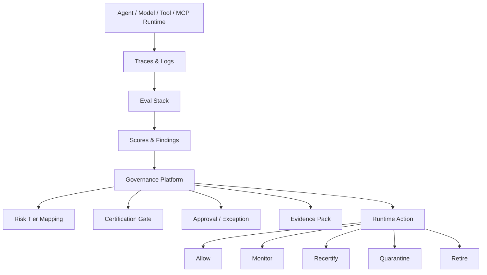

## The Eval Stack Is Real Now

I want to start with a concession, because the easy move is to dunk on the tooling and the easy move is wrong. The eval stack is no longer hand-wavy. I've spent time reading through docs, exploring how different tools approach the same problems, and mapping what's actually there versus what I expected to find. The primitives are genuinely real:

- **Traces:** full multi-step workflows captured with inputs, outputs, intermediate steps, tool calls, latency, tokens, cost
- **Datasets:** versioned collections of test cases built from curation, synthetic generation, production traces, or user feedback
- **Scorers:** code, heuristics, LLM-as-judge, pairwise comparisons, human review, custom domain metrics
- **Experiments:** systematic comparison of prompts, models, and configurations against a fixed dataset
- **Online evaluation:** automatic scoring of production traffic with no ground truth, surfacing regressions in real time
- **Prompt and version tracking:** registry-grade primitives for prompts and configurations
- **Trace-to-dataset loops:** production failures become permanent regression cases, often with one-click curation

The tooling landscape has genuinely converged on these capabilities. Tools like LangSmith, Braintrust, Langfuse, and MLflow each approach them differently, with different center-of-gravity assumptions, different deployment models, and different integration patterns. I'm not here to rank them or score them. I find the diversity of approaches genuinely interesting, and I think the right tool for a given team depends heavily on where they are and what they're optimizing for. What I want to explore is what all of them share: a category boundary that matters more than any feature-level difference between them.

That convergence is useful. It also makes the eval stack look like the governance platform. It isn't.

## What Governance Has to Decide

The eval stack answers questions like: *did the model pass the test? has the score regressed? is the trace clean?* Those are useful questions. They're not the questions a regulated enterprise has to answer.

The questions a governance layer has to answer:

- What system is being evaluated, and how do we know it's the certified version?
- What risk tier applies, and which controls follow from that tier?
- Which evals are required for this tier, and which are optional?
- Which judge or scorer is admissible for this control? Versioned how?
- Who approved the result? Under what authority? When does the approval expire?
- What exception exists, and who accepted residual risk for what duration?
- What production signal triggers recertification?
- What runtime action happens when a control is breached: allow, monitor, recertify, quarantine, or retire?
- How long is the evidence retained, in what form, retrievable by whom, defensible to what jurisdiction?

The eval stack supports parts of this, but it doesn't own the regulated decision model end-to-end. Not as a failure of the tools, as a category boundary. The tools were built to help engineers ship better AI systems. They weren't built to be the system of record for an enterprise's risk posture on AI.

That distinction is the post.

## Signal Is Not Decision

An eval result is a signal. A governance platform turns that signal into a decision. The shape of that decision varies by tier and by trigger:

- A hallucination score below threshold may trigger human review for a T2 system and automatic quarantine for a T1
- A model version change may trigger delta recertification, full rerun, or, at the extreme, operate-in-shadow until parity is verified
- A prompt change may trigger targeted regression tests scoped to the changed behavior
- A production safety score breach may trigger gateway-level intervention with a documented blast radius
- A repeated policy violation may revoke deployment eligibility entirely, not just produce another failed score

None of those decisions emerge from the eval result alone. They emerge from the eval result combined with the risk tier, the policy mapping, the approval state, the change-class routing logic, and the named role authorized to execute the action. That assembly is governance. The eval stack feeds it.

This is also the layer where most platform programs underbuild. Running the eval is the visible work. Wiring the eval result into a graded set of runtime actions, with named decision authority and defensible evidence, is the invisible work. The visible work gets shipped. The invisible work gets postponed until risk asks where it lives.

## The Judge Is Part of the System Under Governance

I want to take the "who checks the checker?" thread from the comments on the last few posts and answer it directly here, because it ties to a specific failure mode in the eval stack that's now well-documented enough to act on.

LLM-as-judge is useful. It's also a measurement instrument with documented failure modes, not an independent truth engine.

**Self-preference bias is now quantified.** Wataoka, Takahashi, and Ri ([arXiv 2410.21819](https://arxiv.org/abs/2410.21819)) introduced a fairness-based metric for self-preference bias and showed GPT-4 exhibits significant bias toward its own outputs, with the suspected mechanism being lower perplexity on familiar stylistic patterns. Pombal, Rei, and Martins ([arXiv 2604.06996](https://arxiv.org/abs/2604.06996)) extended that finding into rubric-based evaluation and found self-preference bias persists even when the rubric is supposed to constrain it. Multiple independent papers have catalogued related failure modes: position bias (judges prefer the first option), verbosity bias (judges prefer longer answers), authority bias (judges prefer outputs that cite sources, regardless of accuracy).

**The mitigation is architecture, not a better judge.** The published mitigations converge on a small number of patterns:

- *Cross-family judging:* when a Claude system is evaluated, the judge is a model from a different family. For material controls, this should be the default, with same-family judging treated as a documented exception
- *Deterministic checks where the rule is knowable:* format validation, citation presence, schema conformance, jailbreak signatures — none of these need a judge
- *Ensemble judging:* multiple judges, weighted, with disagreement as a signal in itself
- *Calibration against human-annotated examples:* the judge's score distribution is anchored against ground truth at intervals; [Langfuse's own LLM-as-judge documentation](https://langfuse.com/docs) recommends this explicitly
- *Judge versioning and regression testing:* the judge is treated as code; when the judge changes, eval results from the previous version aren't directly comparable
- *Evidence of how the score was produced:* judge identity, version, prompt, temperature, ensemble configuration, and calibration state recorded alongside every score

The framing that follows is straightforward: the judge is part of the system under governance. It needs versioning, calibration, independence rules, human baselines, deterministic checks, and monitoring. A governance platform that records eval scores without recording the judge that produced them is recording opinions, not evidence.

The question isn't whether Claude can judge Claude. The question is whether that judgment is independent enough to be admissible as governance evidence. In my experience, same-family judgment is rarely sufficient on its own for any control that matters.

*Source: OpenAI o3 System Card (cited by Superblocks AI Model Governance Analysis)*

## A Map of the Landscape

I want to be clear about what I'm doing in this section. I'm not ranking tools or issuing verdicts. What I find genuinely interesting about this space is how differently tools have approached similar problems, and how those architectural choices reflect different assumptions about who the primary user is.

The tools I've spent the most time exploring each have a different center of gravity.

**LangSmith** is built close to the LangChain and LangGraph development loop. Its strengths are tracing, offline and online evals, production monitoring, and feedback workflows where failed production traces become regression cases. What's interesting about its deployment model is that self-hosting is gated to the enterprise tier, which tells you something about who it's optimized for. For teams already deep in the LangChain ecosystem, that's a natural fit. For teams with strict data residency requirements evaluating the full spectrum of options, it's a dimension worth examining early.

**Braintrust** leans into the product quality and CI/CD loop. Evals in code, immutable experiment snapshots, GitHub Action support, trace-to-dataset workflows, and human review interfaces. What I find interesting about its architecture is the separation between data plane and control plane in its self-hosting model. For many teams that's a reasonable trade. For regulated enterprises, it's an explicit architecture decision that should happen consciously.

**Langfuse** is the most open of the four: MIT-licensed core, fully self-hostable, Postgres and ClickHouse backend, OpenTelemetry-native, broad framework coverage. What I find useful about exploring Langfuse is that it shows what the core substrate can look like when there's no commercial lock on the infrastructure layer. Project-level RBAC, retention policies, and audit logs sit in the enterprise tier, and I've seen their docs note that online deterministic checks are on the roadmap. That's not a criticism — it's an honest signal about where the product is in its development.

**MLflow** operates at a different layer than the dedicated eval platforms. The model registry, experiment tracking, prompt registry, traces, evaluations, AI Gateway, and the `LoggedModel` entity linking model versions to code, config, traces, and evals are all there. Apache 2.0 licensed, Linux Foundation governance, full self-host parity. What's interesting about MLflow in this space is that it approaches eval from a lifecycle management perspective rather than a developer feedback loop perspective. The runtime and online evaluation surface reflects those origins. If you're inheriting MLflow infrastructure from a pre-LLM era and trying to extend it to agentic work, I think it's worth being clear-eyed about the gap between its general MLOps maturity and its LLM-native primitives, which are substantially thinner than the dedicated platforms.

Picking among these four (or the others in this space like Arize Phoenix, Weights & Biases Weave, and Helicone) is a workflow and architecture decision shaped by where your team sits and what you're trying to own versus buy. The capability gap that matters (the governance layer above the eval stack) is the same gap regardless of which one you land on.

## What the Eval Stack Does Not Provide

Stated plainly, so the boundary is clear. This isn't a product criticism. Most of these tools aren't trying to be the enterprise risk system of record.

- **Risk-tier mapping.** A T0 customer-facing agent and a T3 internal research assistant can't share a gate. The eval tools have no concept of risk tier; the policy engine that maps tier to required eval set has to be built.
- **Certification gates.** Pass/fail thresholds exist as scorer outputs. The decision logic that ties a tier-specific eval set to a deployment authorization, including which roles can sign, doesn't.
- **Three-owner accountability records.** Accountable owner, business sponsor, risk owner — none of the tools I've explored encodes this. RBAC exists, but the named roles in regulated frameworks aren't tool primitives. The [ITI AI Accountability Framework](https://www.itic.org/documents/artificial-intelligence/AIFIAIAccountabilityFrameworkFinal.pdf) explicitly identifies three classes of actors in the AI value chain and treats "auditability" as a first-class governance requirement, not an eval output.
- **Exception workflow with expiry.** Exceptions are governance objects with a duration, a compensating control, and a named approver. None of the tools I've looked at tracks exceptions as first-class entities with expiry timers.
- **Recertification trigger router.** Detecting model version change, prompt change, tool change, MCP server change, drift threshold breach, ownership change, regulatory change, incident, and routing each to a defined assessment depth is the trigger layer above the eval stack. The tools detect changes in their own scope. They don't route.
- **Evidence pack assembler.** Tamper-evident, hash-chained, retained-per-jurisdiction record linking dataset version, scorer version, judge identity, prompt version, model version, MCP server version, approval, exception, runtime signal, and incident history. Each tool stores its slice. None of them assembles the pack.
- **Runtime intervention authority.** The decision logic that turns a runtime score breach into a graded action (allow, monitor, recertify, quarantine, retire) and the authority binding that says which role can execute which action.
- **Decommissioning workflow.** Credential revocation, downstream notification, evidence retention, residual exposure assessment. The eval tools don't model the end of an agent's life.

This list is a category map, not a complaint about the tools. Eval tools are eval tools. Governance platforms are governance platforms.

*Source: GRC Pros 2026 AI Assurance Gap Analysis*

## The Architecture Pattern

The picture I find useful is straightforward. The eval stack sits below the governance platform. The governance platform consumes signals from the eval stack and turns them into bounded actions.

The eval stack produces scores. The governance platform decides what those scores mean and what action follows from them. The boundary is the interface between the two, and the interface is what platform teams have to design, because no vendor in either category ships it.

## The Build/Buy Boundary

This is the practical version of the argument, and the part I'd expect platform leaders to act on first.

**What you can adopt from the eval stack:**

- Tracing infrastructure
- Dataset management and versioning
- Scorer frameworks (code, LLM-judge, pairwise, human)
- Prompt experiments and comparison
- Online production scoring
- Human review queues and annotation interfaces
- Model registry primitives where the chosen tool provides them

**What you still have to build:**

- The risk-tier taxonomy and the policy that maps tier to required controls
- The certification gate logic, including approval authority binding
- The exception workflow with expiry and compensating controls
- The three-owner accountability records, with re-validation rules per transition type
- The evidence-pack assembler with cryptographic chain-of-custody
- The recertification trigger router across model, prompt, tool, MCP, drift, policy, ownership, incident, and regulatory triggers
- The runtime intervention engine that converts scores into graded actions with named authority
- The decommissioning workflow, including the six-step propagation from the [last post](https://khaledzaky.com/blog/where-ai-governance-debt-accumulates-the-agent-lifecycle/)

The build/buy line is clean once the boundary is named. Buy the substrate. Build the governance.

*Source: GRC Pros 2026 AI Assurance Gap Analysis*

## Closing

The market is converging on a useful set of eval primitives. That convergence is a positive development. It's also creating a new failure mode: enterprises adopting an eval platform and assuming they have governance, when what they have is signal. In my experience, that gap doesn't surface until someone from risk or compliance asks for the evidence pack, and the team realizes they have scores scattered across tools and no coherent record.

I want to be careful not to overstate this as a criticism of any particular vendor. The tools I've explored are genuinely trying to solve the problems they're built for, and they're doing it well. The gap isn't theirs to close. It's ours to build.

## Next Steps

- If you're running an eval stack today, audit whether your judge identity, version, and calibration state are recorded alongside every score. If they aren't, the scores aren't defensible evidence yet.
- Map your deployed agents to a risk tier. If you don't have a tier taxonomy, that's the first thing to build, because everything else in the governance layer depends on it.
- Identify which governance objects are missing: certification gates, exception workflows with expiry, three-owner accountability records, evidence-pack assembly. The build/buy boundary above is a reasonable starting checklist.
- If you're inheriting MLflow or another pre-LLM eval infrastructure, be explicit about the gap between what it was built for and what LLM-native governance requires before extending it.

*The eval stack is real. The governance layer above it still has to be built.*