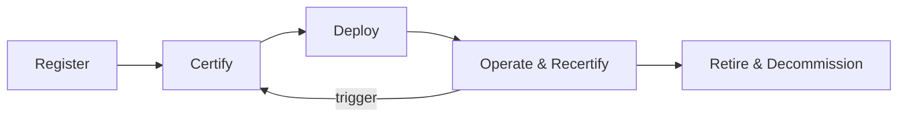

## The First Agent Is Over-Governed. The Tenth Is Where the Debt Starts.

The first agent is usually over-governed. Everyone is watching. Platform, risk, security, engineering, and the business all know what it does. Reviews are thorough. Approval paths are crisp. Documentation gets written. The launch announcement names the team.

The problem starts later.

The agent works, so it expands. Another team copies the pattern. A model version changes. A prompt is patched. A tool is added. The MCP server it depends on gets a quiet update. The original engineer moves to a different team. The evidence record still points to the first approval, but the system in production is no longer the system that was reviewed.

That is governance debt.

[Gartner projects](https://neontri.com/blog/enterprise-ai-agents/) that 40% of enterprise applications will embed task-specific AI agents by end of 2026, up from less than 5% at the start of that year. That kind of proliferation is the exact condition under which "first agent" governance practices collapse under their own weight. [Microsoft's Cloud Adoption Framework](https://learn.microsoft.com/en-us/azure/cloud-adoption-framework/ai-agents/integrate-manage-operate) documents the result: without standardized rollout, monitoring, and maintenance patterns, organizations face "shadow AI proliferation, unpredictable budget overruns, and the accumulation of unused agents that expand the attack surface."

*Source: Gartner prediction (cited in Neontri 2026 Enterprise AI Agents guide)*

This pattern is documented enough now that it has its own vocabulary. [Saviynt](https://saviynt.com/blog/ai-agent-lifecycle-management) calls them "silent escalations of privilege that bypass all of your carefully designed controls." Saviynt also writes about a "zombie army of orphaned agents: identities that are technically dead (unused) but are effectively alive (authorized), waiting for an attacker to exploit them." [Lumenova AI](https://www.lumenova.ai/blog/enterprise-ai-platforms-model-version-control/) frames the broader pattern as "automation debt" that compounds the longer it stays invisible. The vocabulary is converging because the failure mode is converging: agents aren't static software, the systems around them aren't static either, and approval-once / deploy-once governance models don't survive contact with that reality.

The question this post tries to answer is what an honest lifecycle layer looks like when the control plane already exists.

## Five Stages, One Continuous Loop

The model I find useful has five stages. They're not novel: identity-and-security vendors have converged on roughly this shape, and the [Wang et al. AgentOps survey](https://arxiv.org/abs/2508.02121) uses an analogous four-stage operational frame. I'll describe them as stages, but the practical reality is that they form a loop. Operate-and-recertify is the dominant phase by elapsed time. Retire-and-decommission is where most enterprises will discover their governance debt.

**Register.** The agent enters inventory with an identity, an accountable owner, a business sponsor, an explicit purpose, an authorized scope, a data class, a tool authority, an autonomy level, and a risk rating. Everything that follows depends on this record being correct and current. Inventory is the foundation of the control plane and the foundation of lifecycle. You can't govern what you can't find.

**Certify.** Before the agent moves to production, it has to clear a defined gate: required evaluations against curated and adversarial datasets, deterministic checks for the controls that can't be left to model judges, human review at risk-tier-appropriate depth, and an explicit policy mapping that says which controls apply for this use case, model class, data class, and jurisdiction. The output isn't a checkmark. It's an evidence pack.

**Deploy.** This is the stage most architecture diagrams understate. Deployment isn't pushing an agent into production. It's binding a certified system state to a runtime environment. What gets bound:

- Agent version
- Model version (specific, not "latest")
- Prompt version
- Tool versions and authorized scope
- MCP server bindings (specific server identity and version)
- Dataset and eval suite version
- Policy version
- Approval record (who, when, against what gate)
- Environment (where it runs, what it can reach)
- Monitoring configuration
- Rollback and quarantine path

The version-binding list is what makes the next stage operable. You can't detect a model version change if you didn't bind a model version at deploy. You can't detect an MCP server compromise if you didn't bind a specific MCP server identity at deploy. This is where lifecycle governance usually breaks.

**Operate and recertify.** This is where most of the elapsed time lives, and it's where most lifecycle programs underbuild. The agent runs, production traces feed evaluation datasets, drift monitoring runs against the certified baseline, and a defined set of triggers cause the agent to re-enter certification. The triggers aren't a calendar.

**Retire and decommission.** The agent is taken out of service. Credentials are revoked. Tools are disconnected. Downstream systems and integrations are notified. Evidence is retained per the regulatory retention policy. The model is kept on file as a benchmark or fallback for a defined period. Inventory is updated to reflect the retirement, not deleted. This stage looks ceremonial until you realize how often it gets skipped.

The five stages map cleanly onto OSFI E-23's lifecycle expectations, even though E-23 is written for model risk management rather than agent lifecycle management. They also expose the gaps that any honest lifecycle architecture has to fill.

## The Two Stages Where Debt Compounds Fastest

Operate-and-recertify and retire-and-decommission are the stages most likely to be underbuilt, because both feel like maintenance work after the launch announcement.

### Recertification triggers are not a calendar

A common shortcut is to set a quarterly or annual recertification cadence and call it ongoing monitoring. That satisfies the wording of an audit checklist and fails the underlying intent. The intent is that material changes to the agent, the model, the data, the tools, the policy, or the ownership trigger a fresh assessment scaled to the change.

[EY's AI models ongoing monitoring discussion paper](https://www.ey.com/content/dam/ey-unified-site/ey-com/en-ca/services/ai/documents/ey-ai-models-ongoing-monitoring-discussion-paper.pdf) makes this explicit: "the traditional model lifecycle is long and may be incompatible with rapidly evolving AI models," and calls for "a centralized environment to perform validation and automate monitoring, documenting and reporting workflows." Quarterly reviews satisfy the auditors. They don't satisfy the underlying change surface.

The honest list of triggers I'd build against:

- **Model version change:** the provider rotated the underlying model, even minor versions
- **Prompt change:** any non-trivial edit to the system prompt or instruction set
- **Tool change:** adding, removing, or modifying authorized tool calls
- **MCP server change:** a separate trigger from tool change, and an increasingly important one (more on why below)
- **Data scope change:** new sources, expanded retrieval scope, new sensitive classes
- **Drift threshold breach:** production evaluation scores falling below a defined band against the certified baseline
- **Policy change:** new control requirements from risk, security, privacy, or regulatory teams
- **Ownership change:** accountable owner, business sponsor, or escalation owner transitions
- **Incident:** a guardrail activation, quarantine, or material customer impact event
- **Regulatory change:** new guidance, supervisory expectation, or enforcement signal that materially changes the bar

The MCP server trigger deserves its own note, because the threat surface has expanded materially in the last six months. [Saviynt](https://saviynt.com/blog/ai-agent-lifecycle-management) documents the growing MCP vulnerability landscape, including tool poisoning, schema corruption, command injection, and shadow MCP server risks. An MCP server bump isn't an integration update: it's a change in your agent's threat model. If your inventory binds tool authorities but not the specific MCP server version that grants them, you have a recertification trigger you can't fire.

<!-- CITATION FAIL: https://saviynt.com/blog/ai-agent-lifecycle-management - original text attributed specific claims ("50+ known MCP vulnerabilities, 13 of them critical," "Vulnerable MCP Project," "OWASP draft MCP Top 10 in beta," "Trend Micro") to this source but these specific figures and attributions are not confirmed in the research notes excerpt from this source -->

Each trigger doesn't necessarily mean a full recertification. It means a routing decision. Some triggers route to a lightweight delta assessment. Some require a full rerun against the certified gate. The routing logic is itself a governance object that has to be defined, versioned, and approved, not improvised case-by-case by whichever engineer happens to notice.

This is the layer that most platform tooling doesn't provide. MLflow's model registry can track that a version has changed. It can't tell you which trigger fired, what risk tier the agent is in, or which gate the change should re-enter. That logic has to live somewhere. The control plane is the natural home. If it doesn't live there, it'll end up in scattered scripts and Jira tickets, which is the ground state of governance debt.

### Decommissioning is an engineering problem, not an administrative one

The mental model that leads to ghost agents is treating retirement as a config flag. The reality is that an agent in production has accumulated dependencies in places the original team probably didn't document. [Identity vendors keep flagging the same residue](https://saviynt.com/blog/ai-agent-lifecycle-management): API keys, cached tokens, memory stores, vector embeddings, model endpoints, system integrations, downstream systems that depend on the agent's outputs.

Honest decommissioning is a propagation problem. Six things have to happen in a defined sequence and be evidenced:

1. **Agent disabled at the gateway, not in code.** Disabling at the gateway means no path is available even if downstream systems still call.
1. **Credentials revoked across every system the agent had access to**, including the silent ones: vector databases, internal APIs, third-party services, SaaS connectors.
1. **Tools disconnected** and the bindings removed from the inventory, so a future agent doesn't silently re-inherit the same authorities.
1. **Downstream consumers notified** with enough lead time that they can either migrate, accept the loss, or escalate.
1. **Evidence retained** — traces, evaluations, approvals, exceptions, change history — per the regulatory retention SLA. OSFI E-23 explicitly calls out retaining the retired model for a set period as a benchmark or fallback.
1. **Inventory updated** to reflect the retirement, with the date, the reason, the responsible role, and the residual exposure assessment. The agent isn't deleted from inventory. It moves to a retired state.

Every step skipped becomes a future incident. Step 2 skipped is a credential vulnerability. Step 4 skipped is a customer outage. Step 5 skipped is a regulatory finding. Step 6 skipped is the reason somebody three years from now won't be able to answer "did this agent exist."

## Ownership Transfer Is a Lifecycle Event

The most underrated lifecycle event is the one that rarely shows up in vendor materials: the original team that built and certified the agent moves on, and somebody else inherits it.

An orphaned agent is unmanaged delegated authority. That framing is consistent with the [delegation post](https://khaledzaky.com/blog/delegation-is-the-real-identity-problem-in-agentic-ai/): every agent has a principal, a scope, and a chain of authority. When the principal moves and nobody re-binds the chain, the agent doesn't lose its authority. It loses its accountability.

[Saviynt's lifecycle analysis](https://saviynt.com/blog/ai-agent-lifecycle-management) makes the structural problem explicit: unlike contractors who reach a natural end-of-engagement, "an AI agent can run indefinitely without natural expiration." Human IAM has 20+ years of vocabulary and infrastructure for this (joiners, movers, leavers). No parallel construct exists for AI agents in enterprise IAM systems today. The [OpenID Foundation's whitepaper on identity management for agentic AI](https://openid.net/wp-content/uploads/2025/10/Identity-Management-for-Agentic-AI.pdf) identifies the same gap: "Currently, agents often act indistinguishably from users, creating accountability gaps and security risks." True delegation requires explicit on-behalf-of flows, which is precisely what gets severed when an accountable owner transfers without a formal handoff protocol.

This is where OSFI E-23's role clarity becomes useful, but agents need an even sharper operating model. E-23 defines roles such as model owner, developer, reviewer, approver, user, and stakeholder. For agents, I'd extend that into three explicit ownership records: an accountable owner who holds operational responsibility, a business sponsor who holds the use-case authority, and a risk owner who holds residual risk acceptance. All three transition independently and on different calendars.

A few specific questions any honest lifecycle layer has to answer:

- When the accountable owner changes, what re-validation is required? Is the inheriting role at the right level, with the right scope, with the right training?
- When the business sponsor changes, does the use case still match the original certification? If the new sponsor wants to expand scope, that's a recertification trigger, not a quiet update.
- When the risk owner changes, is the residual risk acceptance still valid, or does it need to be reaffirmed? Risk acceptance attached to a person who no longer holds the role isn't risk acceptance.
- Is there a gap period where no role is assigned? Gap periods are where governance debt accumulates the fastest, because no one is empowered to act and no one is accountable for not acting.

The architectural answer is that ownership is a versioned, dated, signed record on the agent in inventory, not a wiki page or an email thread. Same level of rigor as model versions. Same audit trail. [Microsoft's Entra Agent ID best practices](https://learn.microsoft.com/en-us/entra/agent-id/best-practices-agent-id) independently arrive at the same position: "Every blueprint and agent identity must have a sponsor... Periodically verify that these assignments are current, especially when personnel changes occur." The fact that this is still a preview product confirms the gap exists. It also confirms it's not solved yet.

## Where the Tooling Fits and Where It Stops

I want to be precise about what existing tooling provides, because the gap between marketing and reality is wide here.

Eval platforms — LangSmith, Braintrust, and others in that space — handle trace collection, evaluation scoring, and dataset management well. They don't handle trigger routing, risk-tier-aware gate selection, or ownership records. They're instrumentation layers, not governance layers.

Model registries like MLflow track version history and can surface when a model artifact has changed. They don't know what risk tier the consuming agent is in, which policy version it was certified against, or whether the version change constitutes a trigger that requires re-entry into the certification gate. That context has to come from somewhere else.

Identity platforms are starting to move into this space. Microsoft's Entra Agent ID and Saviynt's agent lifecycle work are the clearest examples. Both are early. Both are solving the identity and credential residue problem better than the eval and registry tooling does. Neither provides the full lifecycle loop described above.

The honest picture is that no single platform covers the full five-stage loop today. Most enterprises will assemble this from three to four tools, which means the integration layer, the trigger routing logic, and the evidence aggregation have to be built and owned. The control plane is the natural place to own them. If it doesn't, the governance layer fragments across tools and the audit trail becomes a reconstruction exercise rather than a continuous record.

## Next Steps

If you're building or inheriting an agent governance program, the five-stage loop gives you a diagnostic frame. A few concrete places to start:

- **Audit your deploy bindings.** For every agent in production, confirm that model version, prompt version, MCP server identity, and tool scope are explicitly bound in inventory. If any of those are "latest" or undocumented, you have a recertification trigger you can't fire.
- **Define your trigger list before the next model rotation.** Don't wait for a provider to rotate a model version and then figure out the routing logic under pressure. The trigger list and routing rules are governance objects. Write them down, get them approved, and version them.
- **Treat ownership transfer as a formal handoff, not a Jira reassignment.** The inheriting owner needs to affirm the current state, confirm the risk acceptance is still valid, and be on record. If the handoff protocol doesn't exist, write it before the next team reorganization.
- **Run a decommissioning drill on one retired agent.** Pick an agent that was taken out of service in the last 12 months and trace all six decommissioning steps. Credential revocation, tool disconnection, downstream notification, evidence retention, inventory update. Find out where the gaps are before an auditor does.
- **Locate where trigger routing logic currently lives.** If the answer is "it doesn't" or "in someone's head," that's the first thing to fix. The control plane should own it. If you don't have a control plane yet, a versioned policy document with named owners is a better starting point than nothing.

*The agents that cause the most damage in regulated environments usually aren't the ones that were never governed. They're the ones that were governed once, at launch, and then quietly drifted for eighteen months while everyone assumed someone else was watching.*